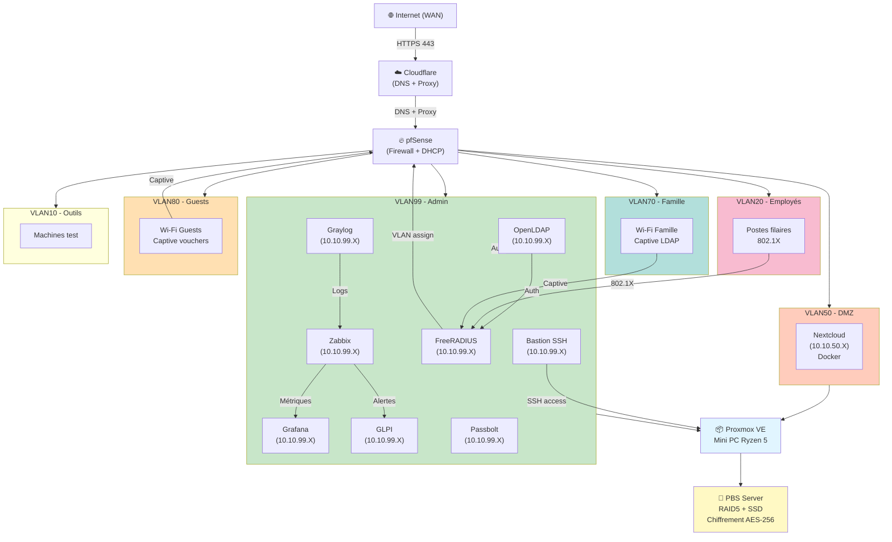

# Architecture du Homelab

> Documentation complète de l'architecture du homelab — vue globale, topologie, flux de données, principes de sécurité.

---

## Vue d'ensemble / Overview

```
┌─────────────────────────────────────────────────────────────┐
│                    INTERNET (WAN)                           │
│              [ISP Fibre/4G + NAT/Routeur]                   │
└────────────────────────┬────────────────────────────────────┘
                         │
                    [Port 443 HTTPS]
                         │
        ┌────────────────┴────────────────┐
        │                                 │
    [pfSense]                        [Cloudflare]
    (Firewall +                      (DNS + Proxy)
     DHCP + DNS +                    
     HAProxy +
     WireGuard CA)
        │
        ├─── VLAN99 (Admin/Mgmt)
        │     ├─ OpenLDAP (10.10.99.X)
        │     ├─ FreeRADIUS (10.10.99.X)
        │     ├─ Zabbix (10.10.99.X)
        │     ├─ Grafana (10.10.99.X)
        │     ├─ Graylog (10.10.99.X)
        │     ├─ Bastion SSH (10.10.99.X)
        │     └─ Passbolt (10.10.99.X)
        │
        ├─── VLAN50 (DMZ)
        │     └─ Nextcloud (10.10.50.X) [Docker]
        │
        ├─── VLAN20 (Employés filaire 802.1X)
        │     └─ Postes de travail (DHCP 10.10.20.0/24)
        │
        ├─── VLAN70 (Famille captive LDAP)
        │     └─ Postes famille (DHCP 10.10.70.0/24)
        │
        ├─── VLAN80 (Guests captive vouchers)
        │     └─ Visiteurs (DHCP 10.10.80.0/24)
        │
        └─── VLAN10 (Outils/Machines)
              └─ Machines de test (DHCP 10.10.10.0/24)

┌─────────────────────────────────────────────────────────────┐
│           PROXMOX VE (Mini PC AMD Ryzen 5)                  │
│  ┌─────────────────────────────────────────────────────────┐│
│  │  VM100: OpenLDAP+LAM                                    ││
│  │  VM101: FreeRADIUS                                      ││
│  │  VM102: Zabbix 7.4.9                                    ││
│  │  VM103: Grafana                                         ││
│  │  VM104: Graylog                                         ││
│  │  VM105: GLPI                                            ││
│  │  VM106: Bastion SSH                                     ││
│  │  VM107: Nextcloud (Docker+Nginx+MariaDB)                ││
│  │  CT108: Passbolt CE (LXC+Docker)                        ││
│  └─────────────────────────────────────────────────────────┘│
│                           │                                 │
│              [Chiffrement nftables policy-drop]             │
│                                                             │
└──────────────────────────┬──────────────────────────────────┘
                           │
             ┌─────────────┴──────────────┐
             │                            │
         [PBS Physique]          [Stockage externe]
     (SSD 500 Go +               (Backup cloud)
      RAID5 3×2 TB)              (Règle 3-2-1)
     Chiffrement AES-256
     Rétention GFS
```

---

## Topologie détaillée / Detailed Topology

### Niveaux d'infrastructure

```
┌─────────────────────────────────────────────────────────────┐
│ NIVEAU 1 : WAN (Internet)                                   │
│ ├─ ISP (Fibre/4G)                                           │
│ └─ IP Publique → Cloudflare → pfSense                       │
└─────────────────────────────────────────────────────────────┘
                         │
┌────────────────────────────────────────────────────────────────┐
│ NIVEAU 2 : Périmètre Firewall (pfSense)                        │
│ ├─ Firewall stateful                                           │
│ ├─ NAT/DNAT (port forwarding sécurisé)                         │
│ ├─ DHCP (6 VLANs)                                              │
│ ├─ DNS (split DNS : prod.exemple-info.org vs exemple-info.org) │
│ ├─ HAProxy (reverse proxy)                                     │
│ ├─ WireGuard VPN                                               │
│ └─ Logs syslog → Graylog                                       │
└────────────────────────────────────────────────────────────────┘
                         │
┌─────────────────────────────────────────────────────────────┐
│ NIVEAU 3 : Segmentation Réseau (VLANs)                      │
│ ├─ VLAN99 (Admin) — [trusted]                               │
│ ├─ VLAN50 (DMZ) — [restricted]                              │
│ ├─ VLAN20 (Employés filaire) — [802.1X auth required]       │
│ ├─ VLAN70 (Famille WiFi) — [captive LDAP]                   │
│ ├─ VLAN80 (Guests WiFi) — [captive vouchers]                │
│ └─ VLAN10 (Outils) — [isolated]                             │
└─────────────────────────────────────────────────────────────┘
                         │
┌─────────────────────────────────────────────────────────────┐
│ NIVEAU 4 : Virtualisation (Proxmox VE)                      │
│ ├─ VM100-VM107 (Debian 12 Bookworm)                         │
│ ├─ CT108 (LXC Debian 12 + Docker nesting)                   │
│ └─ Storage : SSD système + RAID Proxmox                     │
└─────────────────────────────────────────────────────────────┘
                         │
┌─────────────────────────────────────────────────────────────┐
│ NIVEAU 5 : Services Applicatifs                             │
│ ├─ Daemon services : OpenLDAP, FreeRADIUS, Zabbix, etc.     │
│ ├─ Container services : Docker (Nextcloud, Passbolt)        │
│ ├─ Web services : Nginx reverse proxy + SSL                 │
│ └─ Database : MariaDB (Nextcloud)                           │
└─────────────────────────────────────────────────────────────┘
                         │
┌─────────────────────────────────────────────────────────────┐
│ NIVEAU 6 : Sécurité Hôte (nftables)                         │
│ ├─ Policy : DROP (défaut deny)                              │
│ ├─ Rules : Whitelist explicite par service                  │
│ └─ Logging : tous les rejets → Graylog                      │
└─────────────────────────────────────────────────────────────┘
                         │
┌─────────────────────────────────────────────────────────────┐
│ NIVEAU 7 : Supervision & Observabilité                      │
│ ├─ Zabbix (metrics + alertes)                               │
│ ├─ Grafana (dashboards temps réel)                          │
│ ├─ Graylog (centralisation logs)                            │
│ └─ GLPI (ticketing auto depuis alertes Zabbix)              │
└─────────────────────────────────────────────────────────────┘
                         │
┌─────────────────────────────────────────────────────────────┐
│ NIVEAU 8 : Résilience & Continuité                          │
│ ├─ PBS (Proxmox Backup Server) — chiffrement AES-256        │
│ ├─ Stratégie GFS (7j/4w/12m/1y)                             │
│ ├─ Tests de restauration mensuels                           │
│ └─ RTO : 4h | RPO : 24h                                     │
└─────────────────────────────────────────────────────────────┘
```

---

## Flux d'authentification / Authentication Flow

```
┌────────────────────────────────────────────────────────────────────────┬─────────────┐
│                         ACCÈS RÉSEAU                                   │             │
├──────────────────────────────┬─────────────────────────────────────────┼─────────────┤
│           WiFi (WAX200)      │         Filaire (Switch)                │             │
├──────────┬────────┬──────────┼──────────────────┬──────────────────────┼─────────────┤
│  SSID    │  SSID  │   SSID   │   SSID    │  Port VLAN99  │ Port VLAN20 │ Port VLAN10 │
│  Admins  │ Famille│  Guests  │  Admins   │  (Admins)     │ (Employés)  │ (Outils)    │
│  802.1X  │Captive │ Captive  │  802.1X   │               │             │             │
│ EAP-PEAP │  LDAP  │ Vouchers │ EAP-PEAP  │               │             │             │
└────┬─────┴───┬────┴────┬─────┴─────┬─────┴───────────────┴─────────────┴─────────────┘
     │         │         │           │
     │         │    [FreeRADIUS]     │
     │         │   (validation       │
     │         │    voucher)         │
     │         │         │           │
     └─────────┴──[FreeRADIUS]───────┘
                  (EAP-PEAP + LDAP query)
                         │
                    [OpenLDAP]
                  (vérification
                   credentials
                   + groupe)
                         │
                    ✓ ACCEPT
                         │
          ┌──────────────┼──────────────┐
          │              │              │
       VLAN99         VLAN20        VLAN70/80
      (Admins)      (Employés)    (Famille/Guests)
          │              │              │
      DHCP IP        DHCP IP        DHCP IP
          │
   ✓ Connecté au réseau

─────────────────────────────────────────────
ACCÈS ADMINISTRATION (SSH — séparé du réseau)
─────────────────────────────────────────────
Admin → Bastion SSH (port 2222, clé Ed25519)
             │
        [Fail2Ban]
             │
        ✓ Session SSH
             │
        Accès VLAN99
        (Proxmox, VMs...)
```

---

## Flux d'alertes & Ticketing / Alert & Ticketing Flow

```
┌────────────────────────────────────────┐
│      Service monitored                  │
│   (CPU, Disk, Network, etc.)           │
└─────────────┬──────────────────────────┘
              │
         [Zabbix Agent]
         (collecte de métriques)
              │
         [Zabbix Server]
         (agrégation + rules)
              │
      [Alert Rule Triggered ?]
         /           \
      OUI             NON
       │              │
   ✓ Seuil atteint  → [Continue monitoring]
       │
  [Alert Action]
    /        \
   │          │
[Email]   [GLPI API]
   │      (POST ticket)
   │          │
   │      [GLPI Ticket]
   │      (severity: high)
   │          │
   │      [Notifications]
   │      (Assigné à admin)
   │
[Grafana Dashboard]
(Visual alert)
   │
[Admin voit alerte]
   │
[Admin accède bastion]
   │
[SSH → VM problématique]
   │
[Investigation + Fix]
   │
[Ticket résolu]
   │
[Zabbix alert cleared]
```

---

## Flux de sauvegarde / Backup Flow

```
┌──────────────────────────────────────────────────────────────┐
│              Planification (Cron job)                        │
│           Tous les jours à 2h du matin                       │
└─────────────────┬──────────────────────────────────────────┘
                  │
        ┌─────────┴──────────┐
        │                    │
    [VM100-VM107]       [CT108]
      (Debian VMs)       (LXC)
        │                    │
        └─────────┬──────────┘
                  │
          [Proxmox Backup Server]
          (PBS Agent sur VM)
                  │
        ┌─────────┴──────────┐
        │                    │
   [Chiffrement]      [Stockage]
   AES-256 key        /mnt/raid
   (from Passbolt)    (RAID5 3×2To)
        │                    │
        └─────────┬──────────┘
                  │
          [Snapshot de backup]
          ├─ Full (hebdo)
          ├─ Incremental (quotidien)
          └─ Logs → Graylog
                  │
        ┌─────────┴──────────┐
        │                    │
   [Local copy]       [Cloud backup]
   (SSD 500 Go)       (S3 / Nextcloud)
        │                    │
   [Rétention GFS]
   7j quotidien
   4w hebdo
   12m mensuel
   1y annuel
        │
   [Test restore mensuel]
   (Script test-restore.sh)
        │
   [Logs audit]
   (Graylog + GLPI)
```

---

## Segmentation VLAN / VLAN Segmentation

```
┌─ pfSense (10.10.99.X)
│
├─ VLAN99 (Admin) ────────────────────────────┐
│   10.10.99.0/24 — Subnet mask 255.255.255.0 │
│   Hosts : .4 (OpenLDAP), (RADIUS),          │
│           (Zabbix), (Grafana),              │
│           (Graylog), (Bastion),             │
│           (GLPI), (Passbolt)                │
│   Access : Admin only (SSH key + Bastion)   │
│   Policies : Intra-VLAN allowed             │
│              Inter-VLAN : explicit rules    │
└─────────────────────────────────────────────┘
         │
├─ VLAN50 (DMZ) ───────────────────────────────┐
│   10.10.50.0/24 — Subnet mask 255.255.255.0  │
│   Hosts :     (Nextcloud via HAProxy)        │
│   Access : HTTPS from internet (443)         │
│   Policies : Nextcloud → VLAN99 (LDAP only)  │
│              No other VLAN access            │
│   Firewall : stateless, time-limited         │
└──────────────────────────────────────────────┘
         │
├─ VLAN20 (Employés filaire) ─────────────────┐
│   10.10.20.0/24 — Subnet mask 255.255.255.0 │
│   Hosts : DHCP 10.10.20.50-200 (postes)     │
│   Auth : 802.1X EAP-PEAP + FreeRADIUS       │
│   Access : Services VLAN99 (LDAP, NTP)      │
│            Nextcloud (VLAN50)               │
│   Policies : Intra-VLAN : full access       │
│              To VLAN99 : restricted (DNS)   │
│              To VLAN50 : Nextcloud only     │
└─────────────────────────────────────────────┘
         │
├─ VLAN70 (Famille captive) ─────────────────┐
│   10.10.70.0/24 — Subnet mask 255.255.255.0│
│   Hosts : DHCP 10.10.70.50-200 (appareils) │
│   Auth : Captive portal + LDAP username/pw │
│   Access : Nextcloud (VLAN50) uniquement   │
│   Timeout : 1h30 (reconnexion requise)     │
│   Policies : No VLAN99 access              │
│              No inter-VLAN access          │
└────────────────────────────────────────────┘
         │
├─ VLAN80 (Guests captive) ──────────────────┐
│   10.10.80.0/24 — Subnet mask 255.255.255.0│
│   Hosts : DHCP 10.10.80.50-200 (visiteurs) │
│   Auth : Captive portal + voucher code     │
│   Access : Internet uniquement             │
│   Bandwidth : Rate-limited (1 Mbps)        │
│   Timeout : 30 min                         │
│   Policies : COMPLETE ISOLATION            │
│              Aucun accès réseau interne    │
└────────────────────────────────────────────┘
         │
└─ VLAN10 (Outils) ────────────────────────┐
    10.10.10.0/24 — Subnet mask 255.255.255.0
    Hosts : DHCP 10.10.10.50-200 (test gear)
    Access : Admin only (via Bastion)
    Policies : Isolé pour tests sécurité
```

---

## Regles de Firewall pfSense / Firewall Rules

```
Direction : INBOUND (Internet → LAN)

┌─ Rule 1 : WireGuard VPN (UDP 51820)
│  Source : Any
│  Dest : pfSense IP
│  Protocol : UDP 51820
│  Action : ALLOW
│  Logging : Yes (alertes GLPI)
│
├─ Rule 2 : HTTPS public (TCP 443) → HAProxy
│  Source : Any
│  Dest : HAProxy IP (pfSense)
│  Protocol : TCP 443
│  Action : ALLOW (Nextcloud only)
│  Redirect : 10.10.50.X:443 (DMZ)
│  Logging : Yes
│
├─ Rule 3 : SSH Bastion (TCP 2222)
│  Source : Any
│  Dest : pfSense (bastion host)
│  Protocol : TCP 2222
│  Action : ALLOW
│  Logging : Yes (Fail2Ban)
│
└─ [Default] : DROP all

Direction : INTER-VLAN

├─ VLAN20 → VLAN99 (DNS/NTP)
│  Dest Port : UDP 53, UDP 123
│  Action : ALLOW
│
├─ VLAN20 → VLAN50 (Nextcloud)
│  Dest Port : TCP 443
│  Action : ALLOW
│
├─ VLAN70 → VLAN50 (Nextcloud)
│  Dest Port : TCP 443
│  Action : ALLOW
│
├─ VLAN80 → [Any internal]
│  Action : DROP (complete isolation)
│
└─ [Default] : DROP all except explicitly allowed
```

---

## Principes de sécurité / Security Principles

```
┌─────────────────────────────────────────────┐
│ 1. DÉFENSE EN PROFONDEUR                     │
├─────────────────────────────────────────────┤
│ ├─ Périmètre : pfSense firewall (stateful) │
│ ├─ VLAN : segmentation réseau               │
│ ├─ Hôte : nftables policy DROP              │
│ ├─ Application : bastion SSH + Fail2Ban     │
│ └─ Données : chiffrement AES-256 (PBS)      │
└─────────────────────────────────────────────┘

┌─────────────────────────────────────────────┐
│ 2. MOINDRE PRIVILÈGE                        │
├─────────────────────────────────────────────┤
│ ├─ Services : daemon users non-root         │
│ ├─ VLAN : accès minimal (default deny)      │
│ ├─ SSH : clés Ed25519 + Bastion obligatoire │
│ ├─ Sudo : ACL strictes (audit GLPI)         │
│ └─ Données : RBAC OpenLDAP + groupes        │
└─────────────────────────────────────────────┘

┌─────────────────────────────────────────────┐
│ 3. SÉPARATION DES RÔLES                     │
├─────────────────────────────────────────────┤
│ ├─ Admin (VLAN99) : gestion complète        │
│ ├─ Employé (VLAN20) : Nextcloud + services  │
│ ├─ Famille (VLAN70) : Nextcloud +           │
│                  machines VLAN10 (filaire)  │
│ ├─ Guest (VLAN80) : Internet seulement      │
│ └─ Service accounts (LDAP) : minimal access │
└─────────────────────────────────────────────┘

┌─────────────────────────────────────────────┐
│ 4. TRAÇABILITÉ COMPLÈTE                     │
├─────────────────────────────────────────────┤
│ ├─ Logs : centralisés Graylog (syslog)      │
│ ├─ Audit : Bastion SSH + sudo logs          │
│ ├─ Firewall : pfSense stateful logs         │
│ ├─ Alertes : Zabbix + GLPI tickets          │
│ └─ Backups : PBS logs + verification        │
└─────────────────────────────────────────────┘

┌─────────────────────────────────────────────┐
│ 5. RÉSILIENCE & CONTINUITÉ                  │
├─────────────────────────────────────────────┤
│ ├─ Backups : GFS (7j/4w/12m/1y)             │
│ ├─ Chiffrement : AES-256 keys (Passbolt)    │
│ ├─ Tests : restore mensuel (SOP)            │
│ ├─ RTO : 4h | RPO : 24h                     │
│ └─ Monitoring : 24/7 alertes auto           │
└─────────────────────────────────────────────┘
```

---

## Diagramme Mermaid / Mermaid Diagram



---

## Matrice d'accès inter-VLAN / Inter-VLAN Access Matrix

```
              VLAN99   VLAN50   VLAN20   VLAN70   VLAN80   VLAN10
             (Admin)  (DMZ)    (Emp)    (Fam)    (Guest)  (Tools)

VLAN99        ✓ →      ✓        ✓        ✓        ✗        ✓
(Admin)       ← ✓      ← ✓      ← ✓      ← ✓      ← ✗      ← ✓

VLAN50        ✓        ✓ →      ✓        ✓        ✗        ✗
(DMZ)         ← (DNS)  ← ✓      ← (443)  ← (443)  ← ✗      ← ✗
              only     (LDAP)

VLAN20        ✓        ✓        ✓ →      ✗        ✗        ✓
(Emp)         ← (53)   ← (443)  ← ✓      ← ✗      ← ✗      ← ✓
              (123)

VLAN70        ✓        ✓        ✗        ✓ →      ✗        ✗
(Fam)         ← (53)   ← (443)  ← ✗      ← ✓      ← ✗      ← ✗
              (123)

VLAN80        ✗        ✗        ✗        ✗        ✓ →      ✗
(Guest)       ← ✗      ← ✗      ← ✗      ← ✗      ← ✓      ← ✗
              (Internet only)   (No access)

VLAN10        ✓        ✗        ✓        ✗        ✗        ✓ →
(Tools)       ← ✓      ← ✗      ← ✓      ← ✗      ← ✗      ← ✓

Légende :
✓ →   = Accès sortant autorisé
← ✓   = Accès entrant autorisé
(x)   = Port/protocole spécifique
✗     = Bloqué (policy drop)
# Note : VLAN20→VLAN10 ports à définir selon équipements
```

---

**Dernière mise à jour** : Mai 2026
