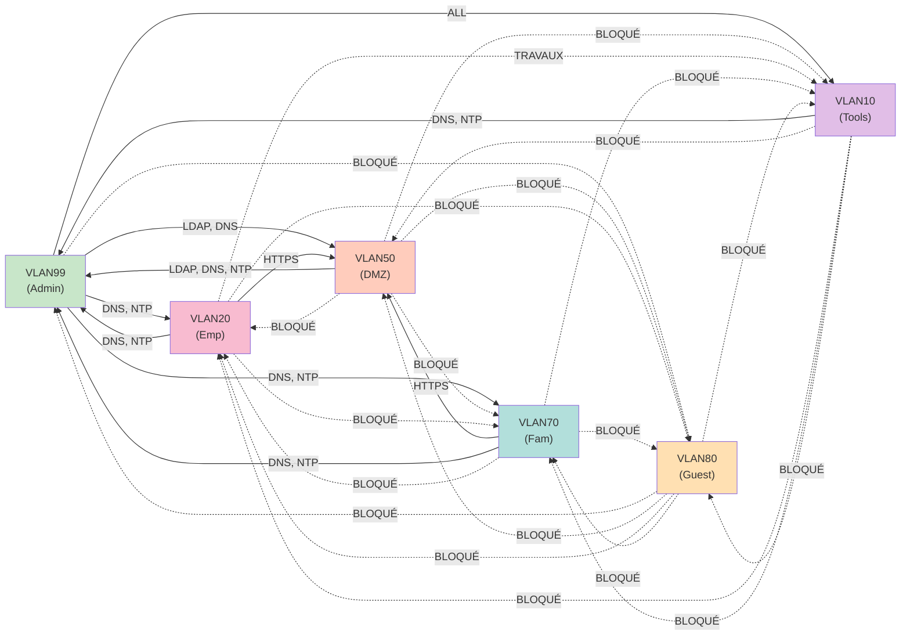

# Network Design — Plan d'adressage et segmentation VLAN

> Documentation complète du design réseau — VLANs, subnets, routage, adressage IP, règles de firewall.

---

## Plan d'adressage global / IP Addressing Plan

```
┌─────────────────────────────────────────────────────────┐
│ Espace d'adressage privé : 10.0.0.0/8                   │
│ Sous-domaine : 10.10.0.0/16 (réservé au homelab)        │
└─────────────────────────────────────────────────────────┘

10.10.0.0/16
├─ 10.10.0.0 - 10.10.9.255      Réservé
├─ 10.10.10.0 - 10.10.19.255    VLAN10 (Outils)
├─ 10.10.20.0 - 10.10.29.255    VLAN20 (Employés)
├─ 10.10.30.0 - 10.10.39.255    Réservé
├─ 10.10.40.0 - 10.10.49.255    Réservé
├─ 10.10.50.0 - 10.10.59.255    VLAN50 (DMZ)
├─ 10.10.60.0 - 10.10.69.255    Réservé
├─ 10.10.70.0 - 10.10.79.255    VLAN70 (Famille)
├─ 10.10.80.0 - 10.10.89.255    VLAN80 (Guests)
├─ 10.10.90.0 - 10.10.98.255    Réservé
└─ 10.10.99.0 - 10.10.99.255    VLAN99 (Admin/Management)
```

---

## VLAN99 : Admin & Management

**Objectif** : Isoler complètement l'infrastructure d'administration

```
VLAN ID : 99
Subnet  : 10.10.99.0/24
Netmask : 255.255.255.0
Gateway : 10.10.99.X (pfSense)
DHCP    : NON (adressage statique uniquement)
DNS     : 10.10.99.X (pfSense)
NTP     : 10.10.99.X (pfSense)

Plage disponible : 10.10.99.1 - 10.10.99.254

ALLOCATION STATIQUE :
┌─────────────┬──────────────────────────┬──────────────────┐
│ IP          │ Hostname                 │ Service          │
├─────────────┼──────────────────────────┼──────────────────┤
│ .X          │ pfsense.prod             │ Gateway/Firewall │
│ .X          │ switch-main              │ Switch principal │
│ .X          │ proxmox.prod             │ Hyperviseur      │
│ .X          │ ldap.prod                │ OpenLDAP + LAM   │
│ .X          │ radius.prod              │ FreeRADIUS       │
│ .X          │ zabbix.prod              │ Zabbix Server    │
│ .X          │ grafana.prod             │ Grafana          │
│ .X          │ graylog.prod             │ Graylog          │
│ .X          │ bastion.prod             │ SSH Bastion      │
│ .X          │ [RÉSERVÉ]                │ -                │
│ .X          │ wax200.prod              │ AP WiFi          │
│ .X          │ switch-dmz               │ Switch DMZ       │
│ .X          │ glpi.prod                │ GLPI             │
│ .X          │ passbolt.prod            │ Passbolt CE      │
│ .X-.99      │ [RÉSERVÉ]                │ Expansion        │
│ .XX-.200    │ [RÉSERVÉ]                │ DHCP statique    │
│ .XXX-.254   │ [LIBRE]                  │ Expansion        │
└─────────────┴──────────────────────────┴──────────────────┘

Access Policy :
├─ Entrée : Bastion SSH (port 2222) + clé Ed25519 uniquement
├─ Intra-VLAN : full access (tous protocoles)
├─ Vers VLAN50 (DMZ) : https/dns only
├─ Vers VLAN20 (Emp) : dns/ntp only
├─ Vers VLAN70 (Fam) : dns/ntp only
└─ Vers VLAN80 (Guest) : BLOQUÉ (policy drop)
```

**Services dans VLAN99** :
- OpenLDAP (port 389, 636 SSL)
- FreeRADIUS (port 1812, 1813)
- Zabbix (port 10050 agent, 10051 server)
- Grafana (port 3000)
- Graylog (port 9000, 514 syslog, 5555 GELF)
- Bastion SSH (port 2222)
- GLPI (port 80/443)
- Passbolt CE (port 80/443)

---

## VLAN50 : DMZ (Services publics)

**Objectif** : Isoler les services exposés à internet

```
VLAN ID : 50
Subnet  : 10.10.50.0/24
Netmask : 255.255.255.0
Gateway : 10.10.50.X (pfSense)
DHCP    : NON (adressage statique)
DNS     : 10.10.99.X (pfSense VLAN99)
NTP     : 10.10.99.X (pfSense VLAN99)

Plage disponible : 10.10.50.1 - 10.10.50.254

ALLOCATION STATIQUE :
┌─────────────┬──────────────────────────┬──────────────────┐
│ IP          │ Hostname                 │ Service          │
├─────────────┼──────────────────────────┼──────────────────┤
│ .X          │ pfsense-dmz              │ Gateway/Firewall │
│ .X          │ nextcloud.dmz            │ Nextcloud        │
│ .XXX-.254   │ [LIBRE]                  │ Expansion        │
└─────────────┴──────────────────────────┴──────────────────┘

Access Policy :
├─ Entrée : HTTPS uniquement depuis internet (port 443)
│           ├─ HAProxy (pfSense) → Nextcloud
│           ├─ Certificat SSL (Let's Encrypt)
│           └─ Cloudflare DNS + Proxy
├─ Vers VLAN99 : LDAP (389) + NTP (123) uniquement
├─ Vers VLAN20 : BLOQUÉ
├─ Vers VLAN70 : BLOQUÉ
├─ Vers VLAN80 : BLOQUÉ
└─ Vers VLAN10 : BLOQUÉ

Firewall Rules :
1. Inbound WAN (443) → HAProxy (pfSense) → Nextcloud (10.10.50.X)
2. Nextcloud → VLAN99 LDAP (10.10.99.X:389) — auth only
3. Nextcloud → VLAN99 NTP (10.10.99.X:123)
4. Tout autre traffic → DROP
```

**Services dans VLAN50** :
- Nextcloud (Docker + Nginx + MariaDB)
  - Port 443 (HTTPS public)
  - Port 389 (LDAP vers VLAN99)
  - Port 3306 (MariaDB interne)

---

## VLAN20 : Employés (Réseau filaire 802.1X)

**Objectif** : Accès contrôlé pour postes de travail professionnels

```
VLAN ID : 20
Subnet  : 10.10.20.0/24
Netmask : 255.255.255.0
Gateway : 10.10.20.X (pfSense)
DHCP    : OUI (plage dynamique)
DNS     : 10.10.99.X (pfSense VLAN99)
NTP     : 10.10.99.X (pfSense VLAN99)

ALLOCATION :
┌─────────────┬──────────────────────────┬──────────────────┐
│ Plage       │ Utilisation              │ Nombre d'IPs     │
├─────────────┼──────────────────────────┼──────────────────┤
│ .X          │ Gateway (pfSense)        │ 1                │
│ .X-.XX      │ Réservé                  │ 48               │
│ .XX-.XXX    │ DHCP (Postes travail)    │ 151              │
│ .XXX-.254   │ Libre                    │ 54               │
└─────────────┴──────────────────────────┴──────────────────┘

DHCP Configuration :
├─ Pool : 10.10.20.50 - 10.10.20.200
├─ Lease time : 24h
├─ Gateway : 10.10.20.X
├─ DNS : 10.10.99.X (search domain: prod.lapps-info.org)
├─ NTP : 10.10.99.X
└─ VLAN assigné par : FreeRADIUS (802.1X auth)

Authentication (802.1X / EAP-PEAP) :
├─ Protocol : PEAP-MSCHAPv2
├─ Server : FreeRADIUS (10.10.99.X:1812)
├─ Backend auth : OpenLDAP (10.10.99.X)
├─ User credential : uid=firstName (from LDAP)
└─ Upon success : VLAN20 assigned by RADIUS

Access Policy :
├─ Intra-VLAN (10.10.20.0/24) : full access (any protocol)
├─ Vers VLAN99 : DNS (53) + NTP (123) only
├─ Vers VLAN50 (DMZ) : HTTPS (443) only [Nextcloud]
├─ Vers VLAN70 : BLOQUÉ
├─ Vers VLAN80 : BLOQUÉ
├─ Vers VLAN10 : ALLOW (envoi travaux, ports à définir)
└─ Vers Internet : via firewall (stateful)

Firewall Rules :
1. VLAN20 → DNS 10.10.99.X:53/udp
2. VLAN20 → NTP 10.10.99.X:123/udp
3. VLAN20 → HTTPS 10.10.50.X:443/tcp [Nextcloud]
4. VLAN20 ← Internet (stateful return traffic)
5. VLAN20 → VLAN10 (ports à définir selon équipements)
6. Tout autre traffic → DROP
```

**Pourquoi 802.1X ?**
- Authentification centralisée (LDAP)
- Assignation VLAN dynamique (FreeRADIUS)
- Audit trail complet (Graylog)
- Isolation automatique en cas d'intrusion

---

## VLAN70 : Famille (Wi-Fi + Captive Portal)

**Objectif** : Accès WiFi familial avec authentification LDAP simple

```
VLAN ID : 70
Subnet  : 10.10.70.0/24
Netmask : 255.255.255.0
Gateway : 10.10.70.X (pfSense)
DHCP    : OUI (plage dynamique)
DNS     : 10.10.99.X (pfSense)
NTP     : 10.10.99.X (pfSense)

ALLOCATION :
┌─────────────┬──────────────────────────┬──────────────────┐
│ Plage       │ Utilisation              │ Nombre d'IPs     │
├─────────────┼──────────────────────────┼──────────────────┤
│ .X          │ Gateway (pfSense)        │ 1                │
│ .X-.XX      │ Réservé                  │ 48               │
│ .XX-.XXX    │ DHCP (Appareils WiFi)    │ 151              │
│ .XXX-.254   │ Libre                    │ 54               │
└─────────────┴──────────────────────────┴──────────────────┘

DHCP Configuration :
├─ Pool : 10.10.70.50 - 10.10.70.200
├─ Lease time : 8h (reconnexion requise)
├─ Gateway : 10.10.70.X
├─ DNS : 10.10.99.X (search domain: prod.exemple-info.org)
└─ NTP : 10.10.99.X

Captive Portal (FreeRADIUS) :
├─ Access point : WAX200 (10.10.99.XX)
├─ SSID : "famille-secure" (WPA2-Enterprise)
├─ Authentication : LDAP username/password
├─ User database : OpenLDAP (cn=admin,dc=prod,dc=exemple-info,dc=org)
├─ Upon success : VLAN70 assigned + internet access
├─ Session timeout : 1h30 (reconnexion requise)
└─ Logs : centralisés Graylog (audit trail)

Access Policy :
├─ Intra-VLAN (10.10.70.0/24) : full access
├─ Vers VLAN99 : BLOQUÉ (sauf DNS/NTP pour appareils)
│  └─ DNS (53) + NTP (123) only
├─ Vers VLAN50 (DMZ) : HTTPS (443) only [Nextcloud]
├─ Vers VLAN20 : BLOQUÉ
├─ Vers VLAN80 : BLOQUÉ
├─ Vers VLAN10 : BLOQUÉ
└─ Vers Internet : via firewall (stateful)

Firewall Rules :
1. VLAN70 → DNS 10.10.99.X:53/udp
2. VLAN70 → NTP 10.10.99.X:123/udp
3. VLAN70 → HTTPS 10.10.50.X:443/tcp [Nextcloud]
4. VLAN70 ← Internet (stateful return traffic)
5. VLAN70 ↔ VLAN20 : BLOQUÉ
6. VLAN70 ↔ VLAN99 : BLOQUÉ (except DNS/NTP)
7. Tout autre traffic → DROP
```

**Pourquoi un portail captif au lieu de 802.1X?**
- Plus simple pour un Wi-Fi résidentiel (tous les appareils ne prennent pas en charge le 802.1X)
- Utilise tout de même LDAP pour une authentification centralisée
- Mécanisme d’expiration pour la sécurité

---

## VLAN80 : Guests (WiFi captive + Vouchers)

**Objectif** : Accès internet sécurisé pour visiteurs (isolation maximale)

```
VLAN ID : 80
Subnet  : 10.10.80.0/24
Netmask : 255.255.255.0
Gateway : 10.10.80.X (pfSense)
DHCP    : OUI (plage dynamique)
DNS     : 8.8.8.8 (DNS public, pas d'accès VLAN99)
NTP     : 8.8.8.8 (NTP public)

ALLOCATION :
┌─────────────┬──────────────────────────┬──────────────────┐
│ Plage       │ Utilisation              │ Nombre d'IPs     │
├─────────────┼──────────────────────────┼──────────────────┤
│ .X          │ Gateway (pfSense)        │ 1                │
│ .X-.XX      │ Réservé                  │ 48               │
│ .XX-.XXX    │ DHCP (Visiteurs)         │ 151              │
│ .XXX-.254   │ Libre                    │ 54               │
└─────────────┴──────────────────────────┴──────────────────┘

DHCP Configuration :
├─ Pool : 10.10.80.50 - 10.10.80.200
├─ Lease time : 30 min (courte session)
├─ Gateway : 10.10.80.X
├─ DNS : 8.8.8.8 (ou 1.1.1.1)
├─ Search domain : NONE
└─ NTP : pool.ntp.org (public NTP)

Captive Portal (FreeRADIUS) :
├─ Access point : WAX200 (10.10.99.X) — même AP que VLAN70
├─ SSID : "guests" (WPA2-Personal ou Open)
├─ Authentication : Voucher code (prégénéré)
│  └─ Vouchers générés et validés par : FreeRADIUS (user-based)
├─ Upon success : VLAN80 assigned + internet-only access
├─ Session timeout : 30 min (court pour sécurité)
├─ Bandwidth limit : 1 Mbps par utilisateur (fairness)
└─ Logs : centralisés Graylog (audit trail)

Voucher Generation (Admin) :
├─ Command : generate-voucher.sh
├─ Format : XXXX-XXXX-XXXX-XXXX (16 caractères)
├─ Validity : 24h (après utilisation)
├─ Max usage : 1 fois (une personne = un voucher)
├─ Storage : OpenLDAP (cn=guest-vouchers, ...)
└─ Distribution : manuel (admin donne le code)

Access Policy (STRICTE ISOLATION) :
├─ Intra-VLAN (10.10.80.0/24) : full access
├─ Vers VLAN99 : BLOQUÉ COMPLÈTEMENT
├─ Vers VLAN50 : BLOQUÉ COMPLÈTEMENT
├─ Vers VLAN20 : BLOQUÉ COMPLÈTEMENT
├─ Vers VLAN70 : BLOQUÉ COMPLÈTEMENT
├─ Vers VLAN10 : BLOQUÉ COMPLÈTEMENT
└─ Vers Internet : OUI (stateful return traffic)

Firewall Rules :
1. VLAN80 → Internet (stateful)
2. VLAN80 ← Internet (stateful return)
3. VLAN80 ↔ [Any internal VLAN] : BLOQUÉ
4. Tout traffic interne → DROP
5. Logs : tous rejetés → Graylog (security audit)

Rate Limiting :
├─ Per-user bandwidth : 1 Mbps
├─ Burst capacity : 5 Mbps/10sec
└─ Total VLAN80 : 50 Mbps (protège VLAN99 de DDoS)
```

**Pourquoi une isolation complète ?**
- Les invités ne doivent PAS avoir accès à l’infrastructure interne
- Empêche les attaques de reconnaissance
- Limite les déplacements latéraux en cas de compromission
- Respecte les bonnes pratiques (DMZ pour les réseaux non fiables)

---

## VLAN10 : Outils & Tests (Isolated)

**Objectif** : Machines outils / laboratoire (isolées, admin-only)

```
VLAN ID : 10
Subnet  : 10.10.10.0/24
Netmask : 255.255.255.0
Gateway : 10.10.10.X (pfSense)
DHCP    : OUI (pour simplicité de test)
DNS     : 10.10.99.X (pfSense)
NTP     : 10.10.99.X (pfSense)

ALLOCATION :
┌─────────────┬──────────────────────────┬──────────────────┐
│ Plage       │ Utilisation              │ Nombre d'IPs     │
├─────────────┼──────────────────────────┼──────────────────┤
│ .X          │ Gateway (pfSense)        │ 1                │
│ .X-.XX      │ Réservé                  │ 48               │
│ .XX-.XXX    │ DHCP (Test machines)     │ 151              │
│ .XXX-.254   │ Libre                    │ 54               │
└─────────────┴──────────────────────────┴──────────────────┘

DHCP Configuration :
├─ Pool : 10.10.10.50 - 10.10.10.200
├─ Lease time : 1h
├─ Gateway : 10.10.10.X
├─ DNS : 10.10.99.X
└─ NTP : 10.10.99.x

Access Policy :
├─ Accès filaire uniquement
├─ VLAN99 → VLAN10 : ALLOW (admin, tous ports)
├─ VLAN20 → VLAN10 : ALLOW (envoi travaux, ports à définir)
├─ VLAN10 → autres VLANs : BLOQUÉ
├─ Vers Internet : BLOQUÉ (isolé)
└─ Purpose : Pentest, security research, isolated testing

Firewall Rules :
1. Bastion SSH → VLAN10 (admin access)
2. VLAN20 → VLAN10 (ports à définir selon équipements)
   # ex: TCP 9100 (impression), TCP 80/443 (interface web)
3. VLAN10 → [Any] : BLOQUÉ
4. VLAN10 → Internet : BLOQUÉ

Purpose & Usage :
├─ Pentest d'infrastructure (Nikto, nmap, etc.)
├─ Security research (sandbox environnement)
├─ Isolation de machines compromises
├─ Testing de policies/rules
└─ Training environnement
```

---

## Résumé des accès inter-VLAN / Inter-VLAN Summary



---

## Règles de Firewall pfSense / pfSense Firewall Rules

### Règles WAN (Internet → LAN)

```
┌─ RULE 1 : WireGuard VPN (UDP 51820)
│  Interface : WAN
│  Protocol : UDP
│  Destination Port : 51820
│  Action : ALLOW
│  Logging : YES
│  Description : "Allow WireGuard VPN from internet"
│
├─ RULE 2 : HTTPS HAProxy (TCP 443)
│  Interface : WAN
│  Protocol : TCP
│  Destination Port : 443
│  Destination : HAProxy (pfSense)
│  Action : ALLOW (redirect to VLAN50:443)
│  Logging : YES
│  Description : "Allow HTTPS Nextcloud (via HAProxy)"
│
├─ RULE 3 : SSH Bastion (TCP 2222)
│  Interface : WAN
│  Protocol : TCP
│  Destination Port : 2222
│  Destination : Bastion (10.10.99.X)
│  Action : ALLOW
│  Logging : YES (critical)
│  Description : "Allow SSH Bastion (Fail2Ban protected)"
│
└─ [DEFAULT] : DROP all inbound
   Logging : YES (rate-limited)
```

### Règles LAN (Inter-VLAN)

```
┌─ RULE 1 : VLAN20 → VLAN99 (DNS/NTP)
│  Source : VLAN20 (10.10.20.0/24)
│  Destination : 10.10.99.X
│  Protocol : UDP
│  Destination Port : 53, 123
│  Action : ALLOW
│  Logging : NO (too verbose)
│
├─ RULE 2 : VLAN20 → VLAN50 (HTTPS Nextcloud)
│  Source : VLAN20 (10.10.20.0/24)
│  Destination : 10.10.50.X
│  Protocol : TCP
│  Destination Port : 443
│  Action : ALLOW
│  Logging : NO
│
├─ RULE 3 : VLAN70 → VLAN99 (DNS/NTP)
│  Source : VLAN70 (10.10.70.0/24)
│  Destination : 10.10.99.X
│  Protocol : UDP
│  Destination Port : 53, 123
│  Action : ALLOW
│  Logging : NO
│
├─ RULE 4 : VLAN70 → VLAN50 (HTTPS Nextcloud)
│  Source : VLAN70 (10.10.70.0/24)
│  Destination : 10.10.50.X
│  Protocol : TCP
│  Destination Port : 443
│  Action : ALLOW
│  Logging : NO
│
├─ RULE 5 : VLAN10 → VLAN99 (Admin access)
│  Source : VLAN10 (10.10.10.0/24)
│  Destination : 10.10.99.0/24
│  Protocol : TCP
│  Destination Port : 22, 53
│  Action : ALLOW
│  Logging : YES (security audit)
│
├─ RULE 6 : VLAN99 → VLAN50 (LDAP + NTP)
│  Source : VLAN99 (10.10.99.0/24)
│  Destination : 10.10.50.X (Nextcloud)
│  Protocol : TCP/UDP
│  Destination Port : 389, 123
│  Action : ALLOW
│  Logging : NO
│
├─ RULE 7 : VLAN50 → VLAN99 (LDAP request)
│  Source : 10.10.50.X (Nextcloud)
│  Destination : 10.10.99.4 (OpenLDAP)
│  Protocol : TCP
│  Destination Port : 389, 636
│  Action : ALLOW
│  Logging : NO
│
├─ RULE 8 : VLAN80 inbound (Guest DHCP)
│  Source : VLAN80 (10.10.80.0/24)
│  Destination : 10.10.80.X (Gateway)
│  Protocol : UDP
│  Destination Port : 67, 68, 53
│  Action : ALLOW
│  Logging : NO
│
└─ [DEFAULT] : DROP all inter-VLAN traffic
   Logging : YES (security audit — rate limited)
   Description : "Policy DROP — explicit allow only"
```

---

## Schéma réseau physique / Physical Network

```
┌─────────────────────────────────────────────────────────────┐
│                    INTERNET (WAN)                           │
│              ISP Fibre (Symétrique 10Gb)                    │
└────────────────────────┬────────────────────────────────────┘
                         │
              ┌──────────┴──────────┐
              │                     │
          [Cloudflare]         [pfSense]
        (DNS + Proxy)      (Firewall + Router)
                              10.10.99.X
              │                     │
              └──────────┬──────────┘
                         │
        ┌────────────────┴────────────────┐
        │                                 │
    [Switch Main]                  [Switch DMZ]
    10.10.99.X                     10.10.99.X
    VLAN99 native                  VLAN50 native
        │                                 │
    ┌───┼─────────┬─────────┬──────┬─────┼───┐
    │   │         │         │      │     │   │
  [Mini   PC]  [pbS]   [WAX200]  [AP2] [Laptop] [Server]
  Proxmox      PBS     WiFi               Admin  Test
  10.10.99.X   10.10.  10.10.99.X
               99.X
   │
   ├─VM100 (OpenLDAP)
   ├─VM101 (FreeRADIUS)
   ├─VM102 (Zabbix)
   ├─VM103 (Grafana)
   ├─VM104 (Graylog)
   ├─VM105 (GLPI)
   ├─VM106 (Bastion)
   ├─VM107 (Nextcloud)
   └─CT108 (Passbolt)
```

---

**Dernière mise à jour** : Mai 2026
